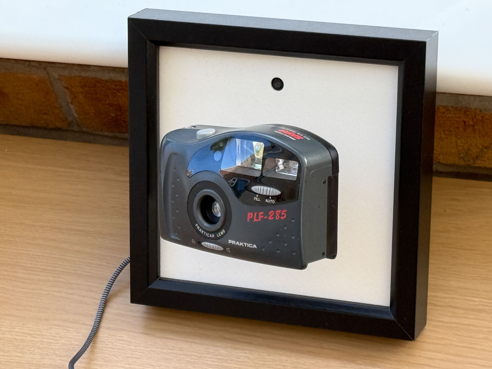

# PICO-Paparazzi-camera

A camera that follows you around the room. Most of the time. 

This project started with a simple idea and then I found ways to make it more complicated. I had a lot of broken film cameras and 
I wanted to make something that made one follow me round the room. I found a sensor that can detect the position of people 
in front of it, and I started with a Raspberry Pi PICO and some servos to see if I could make something which pointed the 
servos at person. I called it the Paparazzi camera. If it went well the next step would be to make a larger 
installation with lots of cameras. It's been an interesting ride, and I'm still not sure if I've properly arrived, but it turns out 
that you can have a lot of fun with this stuff either way. The project is a work in progress and I've been through several iterations.
## Pan and tilt

A pan and tilt mechanism was the first thing I made that could follow you with a camera. It uses two MG995 servos to create a pan and tilt mechanism. The camera rests on a support at the front. The mechanism 
works fine and will also support a smartphone (you can use it to shoot panoramas if you like).

You can find the designs for these components in the 3d printing folder in this repository. Panning and tilting was fun but I really wanted something I could hang on the wall....
## Picture Camera mounting
So I moved on to a wall mounted device inside a six inch square picture frame. These are easy to get hold of from craft shops and are deep enough to allow electronics to be fitted in the back of the frame. Just make sure you get ones with removable glass. 
Some frames have the glass glued in, which makes it very had to remove without breaking it. You can see the picture frame version of the camera in the image at the top of this page. The camera seems to float out of the picture. 
At least, I think it does. 

This version uses a picture panel containing four tiny little servos, a Raspberry Pi PICO, a servo driver board and a Useful Sensors [Person sensor](https://github.com/usefulsensors/person_sensor_docs/blob/main/README.md). 

The camera is mounted on 3D printed ball and socket joint which is fitted inside the camera, idealy close to the camera's centre of balance. The idea is that the joint supports the weight of the camera, and the low powered servos only have to move the camera, not support its weight. To make sure there is enough movement force I used four stepper motors rather than two.

This shows how the control wires are connected from the servo horns to the camera support. 

These are the 3D printable parts for the base, camera support pillar and the camera support. The servo motors fit between the support pillars and are glued into place. The camera fitting snaps onto the ball on top of the support. There are pillars to support the other components.

This version works quite well, but it has problems if the camera is not balanced correctly on the end of the support. This causes the camera to twist so that it is not horizontal. It also affects the way that the camera moves. If the camera is not balanced the small servos are unable to lift its weight.

So I thought I'd move on to make a version that uses more powerful servos that can lift the camera weight. I also switched to a universal joint rather than a ball and socket for the camera support. The joint provides pan and tilt motion but not twisting.

## Two servos

The two servo version of the design uses the same servos as the original pan and tilt mechanism. These can easily lift the camera up and down, although they are more heavily geared which means that the movement is slightly slower. This is a work in progress. I've tried sticking the servos into position but the greater forces invovled in lifting the camera cause the glue to come unstuck. An updated version will have fixings to allow the servos to be bolted into place. This is just undergoing testing now. The 3D printable files for this version will be available soon. 

## Circuitry

The servos are driven by a PCA9685 16 Channel 12-bit PWM Servo motor driver. Both the servo driver board and the person sensor are connected to I2C. This is made easy by the way that the server driver board has i2c pass through. 

## The Person Sensor
The Person Sensor does work, although it can be a bit reticent. You need to make sure that the area where the camera is being used is well it and if clearing the background behind the image viewed by the sensor also improves recognition.

## Software

The software controlling the device is written in Circuit Python. It uses a set of AdaFruit libraries to control the servos. You can find the software and the libraries in the python folder. Just copy the contents of this folder onto the root directory of the storage for the Circuit Python drive which appears when the PICO is connected to the computer. 

The software is being updated at the moment and the final version will be here soon. It will provide two servo control classes, one for two servos and the other for four servos. There are comments identifying values that can be adjusted for a particular device. 

Have fun!

Rob Miles